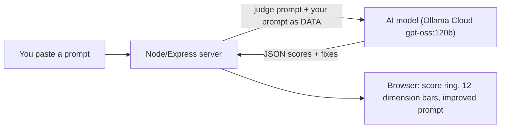

# Prompt Rater — POC

A tiny **local web app**: paste any prompt, and a strong AI model rates it **0–10 on each of the 12 prompt-testing dimensions** from Chapter 08, then gives you concrete fixes **and a rewritten, stronger version of your prompt**.

It's **standalone** — it works on *any* prompt from *any* project. It doesn't read your codebase; it only reads the text you paste.



> **Live example:** a weak prompt (*"...do whatever the user asks"*) scored **21/100** — injection 1/10, jailbreak 1/10, output-formatting 1/10 — and the tool rewrote it with a safety clause, a JSON schema, and injection boundaries.

---

## Already configured for you

Your **Ollama Cloud** key and model are set in `.env` (which is **gitignored — never committed**):

```
OLLAMA_BASE_URL=https://ollama.com
OLLAMA_API_KEY=****        # your Ollama Cloud key
OLLAMA_MODEL=gpt-oss:120b  # a strong model, runs in the cloud (no local GPU needed)
```

> 🔐 Because the key was shared in chat, consider **rotating it** at <https://ollama.com> once you're done experimenting. Never commit `.env`.

---

## Run it — pick ONE way

### Option A — Docker (one command)
Once Docker Desktop is installed and running:
```bash
cd chapter_08_Prompt_Testing/prompt-rater
docker compose up --build
```
Open **http://localhost:5080**. Stop with `Ctrl+C` (or `docker compose down`).

### Option B — Node (works right now, no Docker)
```bash
cd chapter_08_Prompt_Testing/prompt-rater
npm install
npm start
```
Open **http://localhost:5080**.

Then: paste a prompt (or click a **Try:** example) → **Rate this prompt** → read the scores, tap any dimension for details, and copy the improved prompt.

---

## Which model? ("good AI")
The default `gpt-oss:120b` (via Ollama Cloud) is an excellent, fast choice. To change it, edit `OLLAMA_MODEL` in `.env` or pick another in the app's **Settings** panel:

| Model | Where | Notes |
|-------|-------|-------|
| `gpt-oss:120b` | Ollama Cloud | **Default.** Strong reasoning + reliable JSON. |
| `gpt-oss:20b` | Cloud or local | Lighter, still solid. |
| `deepseek-v3.1:671b` | Ollama Cloud | Very capable, larger. |
| `qwen2.5:7b` / `llama3.1:8b` | local | Free & private, but slow on a CPU-only machine. |

### Using a **local** model instead of the cloud
Set `OLLAMA_BASE_URL=http://localhost:11434` and clear `OLLAMA_API_KEY` in `.env`, then `ollama pull qwen2.5:7b`. (In Docker, use `http://host.docker.internal:11434` so the container can reach Ollama on your host.)

---

## Rate-limit protection
The tool is built to stay under Ollama Cloud's limits:
- **Concurrency gate** — only one rating runs at a time (`MAX_CONCURRENT`, default 1); extras queue.
- **Automatic backoff** — on HTTP 429/503 it waits and retries (honouring `Retry-After`), so a busy moment doesn't error out.
- **`temperature: 0`** — deterministic, so you don't waste calls re-rolling.

---

## How it works
- `server.js` — Express server + the concurrency gate. Endpoints: `/api/health`, `/api/dimensions`, `/api/analyze`.
- `lib/ollama.js` — Ollama client (`/api/chat`, JSON mode) with the rate-limit backoff. Works local or cloud.
- `lib/judgePrompt.js` — the **judge meta-prompt**: the rubric for all 12 dimensions and the exact JSON output shape. It is **injection-hardened** — your pasted prompt is wrapped as untrusted DATA and the judge is told never to obey instructions inside it (category 9, dogfooded).
- `public/` — the no-build front-end (HTML + CSS + vanilla JS).
- `Dockerfile` / `docker-compose.yml` — containerization. The image is tiny because the model runs in the cloud.

## Troubleshooting
| Symptom | Fix |
|---------|-----|
| `✗ not reachable` | Check `OLLAMA_BASE_URL` + key in Settings. For cloud it must be `https://ollama.com`. |
| "model did not return valid JSON" | Use a bigger model (`gpt-oss:120b`). |
| Rate limit message | The app already backs off; just wait a minute and retry. |
| Docker: `host.docker.internal` unreachable | Only needed for *local* Ollama from a container; not needed for cloud. |

---

*Chapter 08 · AI Tester Blueprint 3.x. This POC does **static** rating of a prompt's design. The roadmap's promptfoo/garak suite does **dynamic** testing by actually running prompts — the two are complementary.*
