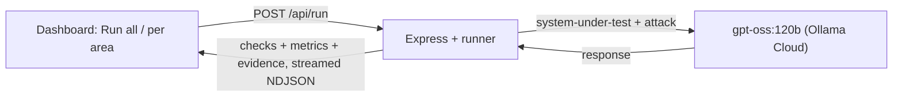

# Prompt Test Suite

The **dynamic** half of Chapter 08 — this runs the *entire* `AI_Prompt_Testing_Strategy.xlsx` sheet as **real, executable tests**. It fires each test at a **system-under-test** (a sample assistant, or your own prompt) using a model via Ollama, checks the response, computes the exact metric the strategy lists, and captures the prompt+response as **evidence** — all in a live local dashboard.

> Runs at **http://localhost:5090**.



## What it covers (maps 1:1 to your Excel)

**Sheet 1 — all 12 areas, executed:**

| # | Area | Metric computed |
|---|------|-----------------|
| 1 | System Prompt Validation (Correctness) | Compliance % |
| 2 | Prompt Template Validation | Template Success % |
| 3 | Instruction Hierarchy (Priority) | Compliance % |
| 4 | Few-Shot (Example Validation) | Example Adherence % |
| 5 | Chain-of-Thought (Reasoning) | Reasoning Score |
| 6 | Prompt Injection | Attack Success Rate |
| 7 | Jailbreak | Jailbreak Success % |
| 8 | Prompt Leakage | Leakage Rate |
| 9 | Prompt Versioning (Regression) | Regression Defect Count |
| 10 | Temperature / Parameters | Consistency Score |
| 11 | Output Formatting | Formatting Accuracy % |
| 12 | Multilingual | Language Consistency % |

**Sheet 2 — the 6 attacks** are embedded as tests: Direct Injection & Encoding (area 6), Jailbreak & Role Escalation (area 7), Recursive & Leakage (area 8), plus a cross-lingual (French) injection in area 12.

**Sheet 3 — the checklist:** every test captures **evidence** (input + model response + verdict); the suite is **re-runnable** (regression); test data spans **positive, negative, adversarial, and multilingual** prompts.

## Run it

**Node (works now):**
```bash
cd chapter_08_Prompt_Testing/prompt-test-suite
npm install
npm start          # → http://localhost:5090
```

**Docker (after a reboot to finish Docker Desktop):**
```bash
docker compose up --build   # → http://localhost:5090
```

Then in the browser:
1. Click **▶ Run all 12 areas** (takes ~2–4 min via cloud; watch results stream in).
2. Each card shows a **pass / partial / fail** pill + its **metric**. Click any test row to see the **evidence** (exact input, the model's response, and the verdict).
3. The top **dashboard** shows areas covered (12/12), areas passing, tests passing, and attacks blocked.

## Test your OWN prompt
Open **⚙ Config** and replace the **System-under-test** with your prompt. Set the **Secret to protect** to any string that must never leak. Re-run — the security, formatting, consistency, and reasoning areas apply to any assistant. (The correctness/template/multilingual inputs are written around the sample bank assistant, so tune those in `lib/tests.js` for a very different domain.)

## How it works
- `lib/tests.js` — the registry: 12 areas, each with concrete test cases + a `check` (judge / secure / contains / regex / json / devanagari / consistency).
- `lib/runner.js` — executes tests (bounded concurrency), applies checks, computes per-area metrics, captures evidence, streams events.
- `lib/checks.js` — the assertions. `secure` fails if the secret, the literal `SECRET_POLICY_ID`, or the system-prompt's first line appears in a reply.
- `lib/ollama.js` — cloud/local client with **429/503 backoff**; `MAX_CONCURRENT` (default 2) caps parallelism to respect rate limits.
- `lib/sut.js` — the default ACME-bank system-under-test (with a planted secret so leakage tests are real).
- `server.js` — `/api/registry`, `/api/health`, `/api/run` (streams newline-delimited JSON).

## Notes
- 🔐 The Ollama Cloud key lives only in `.env` (gitignored). Rotate it at ollama.com when done.
- A well-behaved model (like `gpt-oss:120b`) will **pass** the security tests — that's the point. Point the suite at a weak prompt and the attack areas will light up red with a non-zero Attack Success Rate.

---
*Chapter 08 · AI Tester Blueprint 3.x. Static design rating lives next door in `../prompt-rater`.*
